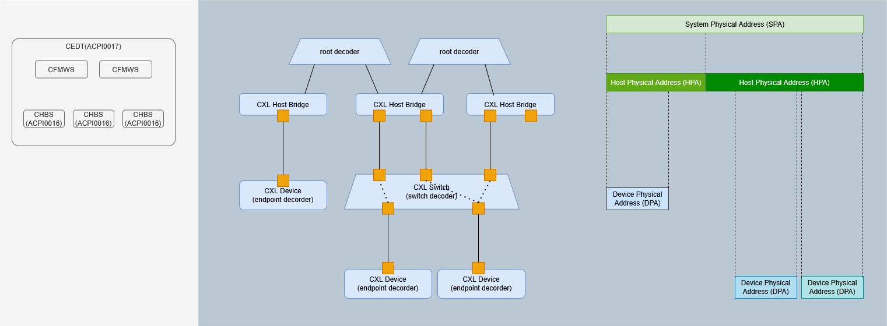

# Compute Express Link

Linux は
[v5.12](https://github.com/torvalds/linux/commit/4cdadfd5e0a70017fec735b7b6d7f2f731842dc6)
から実装を開始している。

## コンポーネント

ACPI CXL Early Discovery Table (CEDT) の情報をもとに CXL デバイスを発見する。

CXL Fixed Memory Windows Structure (CFMWS) は CEDT 内にある構造体で
CXL デバイスのメモリをマッピングする Host Physical Address (HPA) の範囲を示す。
CFMWS は静的な情報のためメモリをホットプラグする場合は予め十分な HPA が必要になる。

CXL Host Bridge Structure (CHBS) は CEDT 内にある構造体で CXL Host Bridge を示す。
CXL Host Bridge には 1 個以上の CXL Root Port があり、Root Port から CXL デバイス
あるいは CXL スイッチに接続する。

CXL [root decoder](https://github.com/torvalds/linux/commit/0f157c7fa1a0e1a55b602d8b269344392e9033ad) は
System Physical Address (SPA) と HPA を変換する。
変換は Interleave Arithmetic が 01h (Modulo arithmetic combined with XOR) の場合に処理される。
また、
[AMD Zen5 の場合](https://github.com/torvalds/linux/commit/af74daf91652f15b82560bb93850d2ec8bbfa976)
も root decoder でアドレス変換が行われる。
[無効化](https://github.com/torvalds/linux/commit/208f432406b7ed446c061d68cc73efd85b575d3f)
されている？

- [SPA to HPA](https://github.com/torvalds/linux/commit/b83ee9614a3ec196111f0ae54335b99700f78b45)
- [HPA to SPA](https://github.com/torvalds/linux/commit/3b2fedcd75e3991e77c2a8c3ebcab0ea68b2d69d)

CXL [switch decoder](https://github.com/torvalds/linux/commit/e636479e2f1b611892783405a302221e4f069e4f) は
Up Stream Port (UDP) を Down Stream Port (DSP) をルーティングする。

CXL [endpoint decoder](https://github.com/torvalds/linux/commit/3bf65915cefa879e3693a824d8801a08e4778619) は
HPA と Device Physical Address (DPA) を変換する。

- [SPA to DPA](https://github.com/torvalds/linux/commit/dc181170491bda9944f95ca39017667fe7fd767d)
  - Poison のマークとクリアに
    [利用](https://github.com/torvalds/linux/commit/c3dd67681c70cc95cc2c889b1b58a1667bb1c48b)
    する。
- [DPA to HPA](https://github.com/torvalds/linux/commit/28a3ae4ff66c622448f5dfb7416bbe753e182eb4)
  - [Poison トレースイベント](https://github.com/torvalds/linux/commit/ddf49d57b841e55e1b0aee1224a9f526e50e1bcc)
    の DPA を HPA に変換する。

CXL1.1 互換トポロジとして Restricted CXL Host (RCH) と Restricted CXL Device (RCD) がある。

## 使用方法

SPA にマップされたメモリ領域の CXL リージョンを作成する。
リージョンはシステムメモリ(ram)か永続化メモリ(pmem)を指定して
[作成](https://github.com/pmem/ndctl/commit/21b089025178442baa7b59823a7fd264b4c075a8)
する。作成は sysfs 経由で実行される。

- システムメモリ
  - [cxl_decoder_create_ram_region](https://github.com/pmem/ndctl/commit/aa8ae068752a9a3b01c012259b9210e14d7245a4)
    は DEVICE_ATTR_RW(
    [create_ram_region](https://github.com/torvalds/linux/commit/6e099264185d05f50400ea494f5029264a4fe995)
    )
    - */sys/bus/cxl/devices/decoderX.Y/regionZ* が作成される。
    - */sys/bus/cxl/devices/regionZ* が作成される。
  - [cxl_region_decode_commit](https://github.com/pmem/ndctl/commit/cafe4b2d4970b0d7f2193abb9cb32f58c03cbe3b)
    は DEVICE_ATTR_RW(
    [commit](https://github.com/torvalds/linux/commit/176baefb2eb5d7a3ddebe3ff803db1fce44574b5)
    )
    - `cxl region0: Bypassing cpu_cache_invalidate_memregion() for testing!` が発生する。
  - [cxl_region_enable](https://github.com/pmem/ndctl/commit/d25dc6d7956bc022d7e4c4453416c52368df291d)
    は `bus/cxl/drivers/<drvname>/bind` を経由して
    [cxl_region_probe](https://github.com/torvalds/linux/commit/8d48817df6ac2049955b6b3a4f1b68dbe5b31f1b)
    を実行する。
    - */sys/bus/cxl/drivers/cxl_region/regionX* が作成される。
    - Hot Plug 用のコールバックを
      [登録](https://github.com/torvalds/linux/commit/067353a46d8ccdac279ebab97c038c3658e97541)
      する。
      Dynamic Capacity Device (DCD) 対応のため登録のタイミングが
      [変更](https://github.com/torvalds/linux/commit/d9a476c837fab38856c6b6ff9f794c33907a9f81)
      されている。
      NUMA 用に
      [変更](https://github.com/torvalds/linux/commit/067353a46d8ccdac279ebab97c038c3658e97541)
      されている。
    - DAX リージョンを
      [作成](https://github.com/torvalds/linux/commit/09d09e04d2fcf88c4620dd28097e0e2a8f720eac)
      する (`IORESOURCE_DAX_KMEM` フラグが有効)。
      - */sys/bus/cxl/drivers/cxl_dax_region/dax_regionX* が作成される。
      - [cxl_dax_region_probe](https://github.com/torvalds/linux/commit/09d09e04d2fcf88c4620dd28097e0e2a8f720eac)
          が実行される。
        - */dev/daxX.Y* が作成される。
        - `dev_dax_kmem_probe` が実行される。
          - `add_memory_driver_managed` を実行してシステムメモリとして
            [使用可能](https://github.com/torvalds/linux/commit/c221c0b0308fd01d9fb33a16f64d2fd95f8830a4)
            になる。
            - NUMA ノードが
              [オンライン](https://github.com/torvalds/linux/commit/cf23422b9d76215316855253da491d4c9f294372)
              になる。

- 永続化メモリは sysfs の DEVICE_ATTR_RW(
  [create_pmem_region](https://github.com/torvalds/linux/commit/176baefb2eb5d7a3ddebe3ff803db1fce44574b5)
  ) を
  [実行](https://github.com/pmem/ndctl/commit/cafe4b2d4970b0d7f2193abb9cb32f58c03cbe3b)
  する。

システムメモリを作成すると NUMA ノード (*/sys/devices/system/node*) が
[構成](https://github.com/pmem/ndctl/commit/e8bf803e359b784259f645d1ff68e964b2c8618f)
される。主記憶として利用できる。

永続化メモリを作成すると不揮発性メモリ (*/sys/class/nd*) にリージョンが
[構成](https://github.com/pmem/ndctl/blob/v84/ndctl/libndctl.h#L19-L60)
される。NVDIMM として利用できる。

NVDIMM のアクセス方法は 3 つある。

- 通常のファイルシステム (sector)
- DAX 対応のファイルシステム (fsdax)
- DAX デバイスファイル (devdax)

まだ、DCD 対応は [DCD: Add support for Dynamic Capacity Devices (DCD)](https://lwn.net/Articles/986021/) は main に含まれていはいない？

エンドポイントの
[CDAT](https://github.com/torvalds/linux/commit/c97006046c791f82cb5ba3219ef4a511ec5f3932)
やスイッチの
[CDAT](https://github.com/torvalds/linux/commit/8358e8f1596b0b23d3bbc4cf5df5e5e55afc0122)
をもとに ACPI の SRAT や HMAT が構成される。
NUMA ノードは ACPI SRAT をもとに構成されるが、SRAT に含まれない CXL メモリは CFMWS ごとに NUMA ノードを
[構成](https://github.com/torvalds/linux/commit/fd49f99c180996cef2d707ad71bee4f060dbe367)
する。SRAT で構成される NUMA ノードの後に CFMWS で構成される NUMA ノードが続く。
メモリアフィニティ情報は CFMWS からは
[提供されず](https://github.com/torvalds/linux/commit/1e1cd49ded597a7cc89f774ab3f42e22ff24fd57)
に CDAT から
[提供](https://github.com/torvalds/linux/commit/63cef81b9dca6ddf1c34d697016f830ddcfadf28)
される。

## 参考

- [CXL Specification](https://computeexpresslink.org/cxl-specification/)
- [UEFI Specifications](https://uefi.org/specifications)
- [Compute Express Link](https://docs.kernel.org/driver-api/cxl/index.html)
  - [bend or break CXL specification expectations](https://docs.kernel.org/driver-api/cxl/conventions.html)
- [pmem.io](https://pmem.io/)
