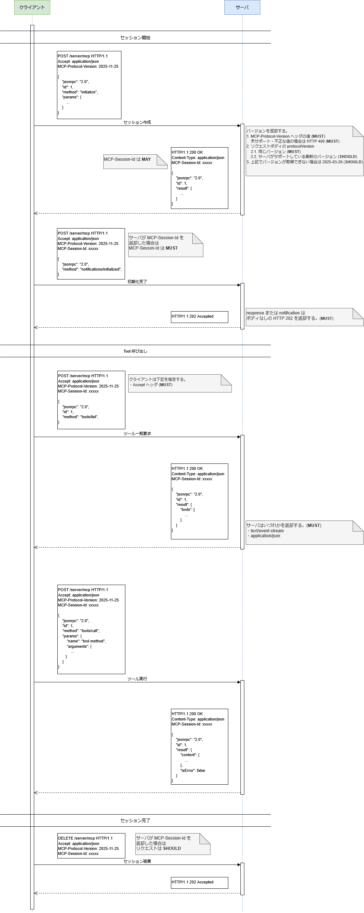
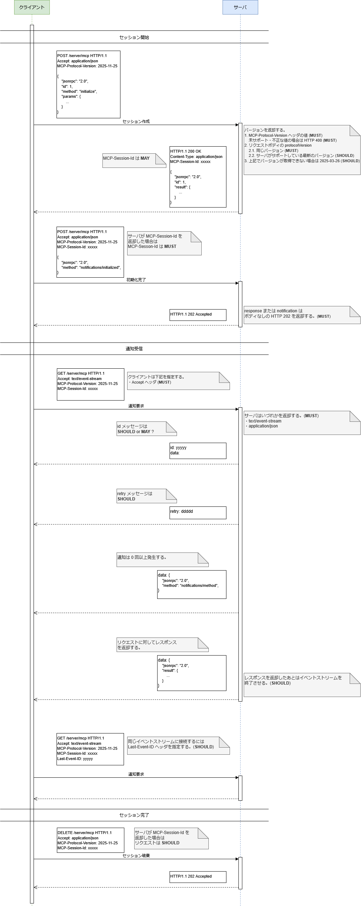

# フロー

プロトコルバージョン `2025-11-25` について記載する。

## Streamable HTTP

1 つのエンドポイントに対して HTTP POST と Server Side Event (SSE) の 2 つの HTTP セッションを使用する。
サーバからクライアントへの通知が不要な場合は SSE は必要ない。

SSE を使用しない場合のフローを記載する。

SSE を使用する場合のフローを記載する。
SSE は HTTP GET または `Accept: text/event-stream` を指定して開始する。

