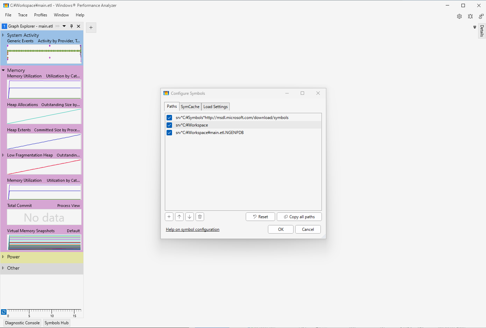
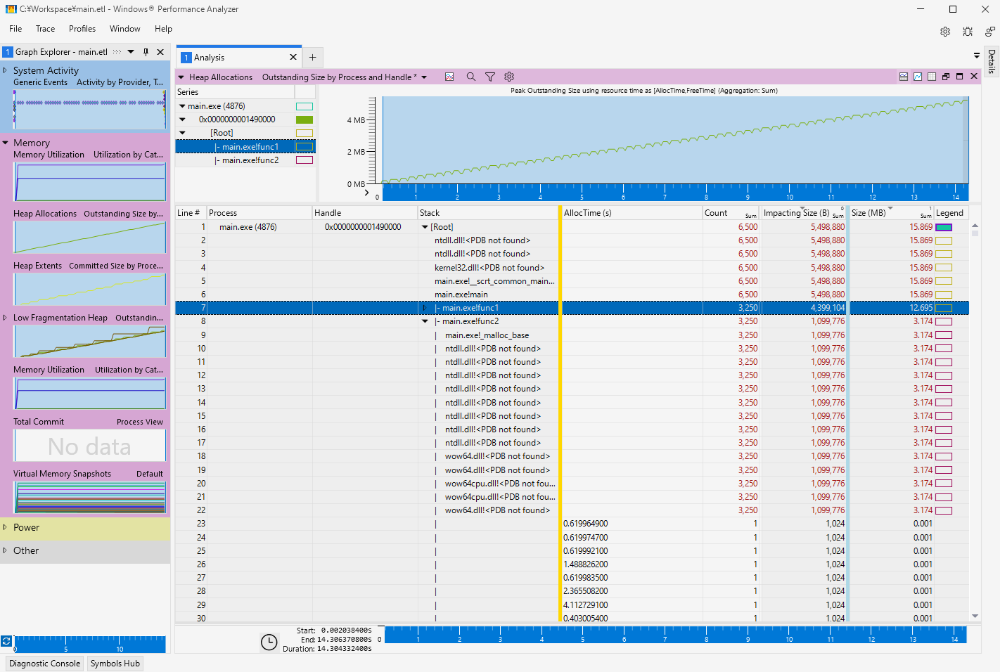

# Windows Performance Toolkit

Windows Performance Recorder (WPR) と Windows Performance Analyzer (WPA) を使う。

WPR は標準で *C:\Windows\System32\wpr.exe* にインストールされている。
WPA は Windows ADK から Windows Performance Toolkit (WPT) をインストールする。

## サンプルアプリケーション

[main.c](main.c) をデバッグビルドして PDB ファイルを生成する。

```sh
cl.exe /Zi main.c
```

## ヒープメモリ追跡

対象のプロセスのヒープトレースを有効化する。管理者権限で実行する。

```sh
wpr.exe -heaptracingconfig main.exe enable
```

```text
Heap tracing was successfully enabled for process main.exe.
```

トレースを開始する。フォルダに一時ファイルが作成される。

```sh
wpr.exe -start Heap -filemode -recordtempto <Path\\To\\Directory>
```

トレース状況を確認する。

```sh
wpr.exe -status
```

```text
WPR recording is in progress...

Time since start        : 00:00:25
Dropped event           : 0
Logging mode            : File
Temp Folder     : C:\Temp\wpr\
```

トレースを停止する。ETL ファイルに出力して一時ファイルは削除される。

```sh
wpr.exe -stop <Path\\To\\File.etl>
```

対象のプロセスのヒープトレースを無効化する。

```sh
wpr.exe -heaptracingconfig main.exe disable
```

```text
Heap tracing was successfully disabled for process main.exe.
```

WPA で ETL ファイルを読み込む。


PDB ファイルがあるフォルダをシンボルパスに追加して [Load Symbols] を実行する。



`func1` と `func2` でメモリ確保していることが確認できる。
解析期間に発生したメモリ割り当ての増減は `Impacting Size` で確認できる。
確保と解放が行われていれば `Impacting Size` は 0 になる。



表示されている設定を [Profiles]-[export] で wpaProfile ファイルをエクスポートする。
ETL ファイルとプロファイルで CSV に出力する。出力できるのは黄色と青色の線の間にある項目となる。

```sh
wpaexporter.exe -i <Path\\To\\File.etl> -profile <Path\\To\\File.wpaProfile> -outputfolder <Path\\To\\Directory>
```

## 参考

- [Windows Performance Toolkit](https://learn.microsoft.com/ja-jp/windows-hardware/test/wpt/)
